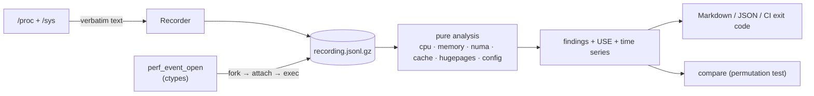

# Kernel Performance Toolkit (`kptk`)

**A Linux kernel performance analysis toolkit for CPU scheduling, memory behaviour, NUMA
locality, cache efficiency, page faults and huge pages.** It explains *why* a workload is slow,
with evidence from kernel counters and a concrete fix.

- **Zero dependencies**: Python standard library only; safe to drop onto a production host.
- **Low overhead**: records raw `/proc` and `/sys` text (~1.4 ms per sample measured on a laptop) and analyses later, anywhere.
- **Hardware counters without `perf`**: calls `perf_event_open(2)` directly via ctypes, with multiplexing correction.
- **Correct kernel semantics**: run-queue delay instead of "CPU %", allocation vs access locality for NUMA, THP fallback and compaction instead of just "THP on".

```
$ kptk demo numa_misplaced

### 🔴 About 85% of the process's memory accesses are likely remote: threads ran mostly on node 0, memory sits mostly on node 1
Evidence: `cpu_node_residency={0: 1}`, `memory_by_node={0: 0.15, 1: 0.85}`, `placement_mismatch=0.85`, `expected_slit_distance=19.4`
Action: Start it with numactl --cpunodebind=1 --membind=1, or migratepages 4242 1 0.

### 🟠 Likely memory-bound: IPC 0.60, LLC 17.9 misses per 1k instructions; anonymous working set 49152 MiB vs 32 MiB L3
### 🟠 dTLB miss rate 3.0% (10.00 per 1k instructions): page walks are significant
### 🟠 THP enabled=always with defrag=always: page faults may stall on synchronous compaction
### 🟠 44% of huge-page faults fell back to 4 KiB pages
...
```
<sub>Synthetic two-socket scenario. Full report: [`samples/numa_misplaced_report.md`](samples/numa_misplaced_report.md);
a real laptop recording is in [`samples/laptop_profile_report.md`](samples/laptop_profile_report.md).</sub>

## What it measures

| Domain | Key signals | Example findings |
|---|---|---|
| **CPU scheduling** | `/proc/schedstat` run-queue delay, per-task wait share, PSI cpu, voluntary vs involuntary switches, steal, per-CPU imbalance | CPU saturation; process waits 45% of runnable time in run queues; preemption storm |
| **Memory and faults** | minor/major fault rates, direct reclaim (`allocstall`), swap, PSI memory, MemAvailable | Direct reclaim stalls; major faults; minor-fault storm from allocator churn |
| **NUMA locality** | `local_node`/`other_node`, AutoNUMA hinting-fault locality, `numa_maps` placement vs thread residency, SLIT distances, per-node free memory | Process misplaced across nodes; node exhausted, so allocations spill remote |
| **Cache efficiency** | IPC, LLC MPKI, branch and L1D miss rates, multiplexing coverage | Likely memory-bound (working set vs LLC); bad speculation |
| **TLB and huge pages** | dTLB MPKI, THP mode and defrag, fallback %, compaction stalls, heap THP coverage, idle hugetlb pools | Sync compaction risk; THP fallback (fragmentation); low coverage with TLB pressure |
| **Configuration** | `zone_reclaim_mode`, governors, `numa_balancing`, `perf_event_paranoid` | Risky sysctls, profiling blocked |

Every report also has a **USE table** (utilisation / saturation / errors per resource),
**sparklines** over time, and a **data-quality** section listing anything the kernel didn't expose.

## Quick start

```bash
pip install -e .            # or just: PYTHONPATH=src python3 -m kptk ...

kptk inspect                                   # topology, caches, THP/hugetlb, sysctl audit
kptk demo --list && kptk demo cpu_saturated    # synthetic two-socket scenarios
kptk profile -- ./my_workload --args           # counters + recording for one command
kptk record -p <pid> -d 60 -o svc.jsonl.gz     # watch a running process
kptk analyze svc.jsonl.gz --md report.md --json report.json --fail-on warning
kptk compare --before a*.json --after b*.json  # permutation-tested A/B
```

More workflows, including the CI gate and a full case study: [docs/examples.md](docs/examples.md).

## How it works



* **Capture, then analyse** ([ADR-1](docs/design-decisions.md)): the recorder never parses, so
  recordings are portable, re-analysable and cheap to take.
* **Exact counting from the first instruction** (ADR-4): fork, child blocks before exec,
  parent attaches counters with `enable_on_exec`, then releases it (the `perf stat` handshake).
* **Expensive files are rate-limited** (ADR-8): `numa_maps`/`smaps_rollup` walk the target's
  page tables, so they're read every N samples.

Details: [architecture](docs/architecture.md) · [metric reference](docs/metrics.md) ·
[kernel mechanics](docs/linux-performance.md) · [design decisions](docs/design-decisions.md)

## Microbenchmarks

`benchmarks/c/` reproduces each phenomenon on real hardware. They're built by `make bench-build`
but never run in CI, because they are deliberately heavy:

| Benchmark | Shows |
|---|---|
| `mem_latency [--huge]` | Pointer-chase latency vs working set: L1/L2/L3/DRAM cliffs, and the TLB-reach shift with huge pages; under `numactl` the remote-node penalty |
| `page_fault_cost [MiB]` | First-touch cost: base pages vs `MAP_POPULATE` vs THP vs pre-faulted |
| `wakeup_latency [n cpuA cpuB]` | Block/wake latency percentiles; same core vs same socket vs cross-socket |
| `false_sharing [threads]` | Cache-line ping-pong: packed vs padded per-thread counters |

## Project layout

```
src/kptk/
  parsers/        proc.py · sysfs.py · tools.py (perf stat, vmstat, numastat text)
  analysis/       cpu · memory · numa · cache · hugepages · engine · findings · window
  record.py       Source abstraction, deadline-scheduled Recorder, JSONL recordings
  perf_event.py   perf_event_open via ctypes (attr struct, encodings, multiplex scaling)
  profile.py      fork → attach → exec profiling
  topology.py     CPUs, SMT, sockets, NUMA nodes/distances, cache hierarchy
  compare.py      multi-run A/B with permutation test
  synth.py        synthetic two-socket recordings (tests, demo)
  report.py · cli.py
benchmarks/c/     mem_latency · page_fault_cost · wakeup_latency · false_sharing
samples/          real laptop recording, synthetic scenario, v0.1 text inputs, generated reports
docs/             architecture · metrics · linux-performance · examples · design-decisions · interview-guide
```

## Requirements and permissions

Linux, Python ≥ 3.10. Everything except hardware counters works unprivileged. Counters need
`kernel.perf_event_paranoid ≤ 2` or `CAP_PERFMON`; without them the report says so and
continues. Run-queue latency needs `CONFIG_SCHEDSTATS`; PSI needs `CONFIG_PSI`.
`scripts/setup_hugepages.sh` reserves hugetlb pages and requires root.

## Development

```bash
make check         # ruff + mypy + pytest (43 tests, < 1 s; no CPU-heavy tests)
make bench-build   # compile microbenchmarks (does not run them)
make samples       # regenerate the sample reports
```

## Limitations and roadmap

- Counting, not sampling: no stacks or code attribution. Pair it with `perf record` or eBPF.
- Generic PMU events give a coarse "top-down lite"; next is Intel topdown slots / AMD equivalents.
- Process view is pid-level. Next: per-thread residency from `/proc/<pid>/task/*`.
- Next: eBPF run-queue latency histograms, and cgroup v2 (`cpu.stat` throttling, per-cgroup PSI).

## License

Apache-2.0. See [LICENSE](LICENSE).
