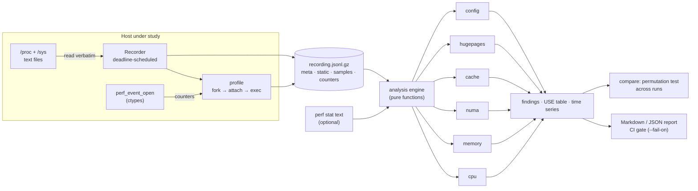

# Architecture

## Goals

1. **Safe to run on production hosts**: no kernel modules, no eBPF, no `perf` binary, no
   runtime dependencies, sub-millisecond-per-sample overhead, read-only.
2. **Correct kernel semantics**: every metric traces back to a documented kernel counter
   and is interpreted the way the kernel defines it (see [metrics.md](metrics.md)).
3. **Actionable output**: findings with evidence and a concrete next step, not a wall of numbers.
4. **Reproducible analysis**: what was captured can be re-analysed anywhere, later.

## Capture, then analyse

The recorder **never parses**. It copies file contents into the recording and timestamps
them. This split matters for three reasons:

* **Overhead**: a sample is ~20-40 `open/read/close` calls, ~1 ms on a laptop and far below 1%
  of a core at 1 s intervals. Parsing happens off the hot path.
* **Portability**: a recording from a locked-down production host can be analysed on a laptop,
  attached to a ticket, and re-analysed after a parser fix or threshold change.
* **Testability**: analysis is a pure function `Recording -> Report`. Tests feed it synthetic
  recordings (`kptk/synth.py`) of a two-socket server and assert exact findings.

## Recording format

JSONL (optionally gzipped), one object per line:

| line | content |
|---|---|
| `{"type": "meta", ...}` | host, kernel, arch, `user_hz`, page size, interval, target pid/command, `static` files |
| `{"type": "sample", "ts", "cost_s", "files"}` | dynamic files at one instant, plus the recorder's own cost |
| `{"type": "counters", "events"}` | hardware/software counter totals (optional) |

**Static** (captured once): CPU topology, cache hierarchy, NUMA cpulists and SLIT distances,
THP and khugepaged settings, hugetlb pools, relevant sysctls, cpufreq governors.
**Dynamic** (every sample): `/proc/{stat,schedstat,vmstat,meminfo,loadavg}`, PSI, per-node
`numastat` and `meminfo`, and for a target pid `stat`, `status`, `schedstat`.
**Slow** (every N samples): `/proc/<pid>/{numa_maps,smaps_rollup}`. These walk the target's
page tables under its mmap lock, so reading them every sample would perturb the process being
measured.

## Modules

| Module | Role |
|---|---|
| `parsers/proc.py`, `parsers/sysfs.py` | Pure parsers for /proc and /sys formats |
| `parsers/tools.py` | `perf stat` (CSV + human, keeps multiplexing %), `vmstat`, `numastat` text |
| `record.py` | `Source` abstraction (live / dict), `Recorder`, `Recording` I/O |
| `perf_event.py` | `perf_event_open(2)` via ctypes: attr struct, event encoding, multiplex scaling |
| `profile.py` | fork → attach counters (`enable_on_exec`) → exec, plus recording until exit |
| `topology.py` | CPUs, SMT, packages, NUMA nodes and distances, cache hierarchy |
| `analysis/window.py` | First/last-sample deltas and rates |
| `analysis/{cpu,memory,numa,cache,hugepages}.py` | Domain analyzers → metrics + findings |
| `analysis/engine.py` | Orchestration, config audit, USE summary, time series, data quality |
| `analysis/findings.py` | `Finding`, `Severity`, tunable `Thresholds` |
| `compare.py` | Multi-run A/B comparison with a permutation test |
| `report.py` | Markdown rendering |
| `synth.py` | Synthetic two-socket recordings for tests and `kptk demo` |
| `cli.py` | `inspect`, `record`, `profile`, `analyze`, `compare`, `parse`, `demo` |
| `benchmarks/c/` | Microbenchmarks that reproduce each phenomenon on real hardware |

## Failure handling

Kernels differ (CONFIG_SCHEDSTATS, PSI, THP, perf permissions, VMs without a PMU), and
processes exit mid-recording. Every reader returns `None` instead of raising, every analyzer
skips what it can't compute, and the report's **data quality** section lists what was missing
and why. A partial report says so explicitly instead of failing silently.
